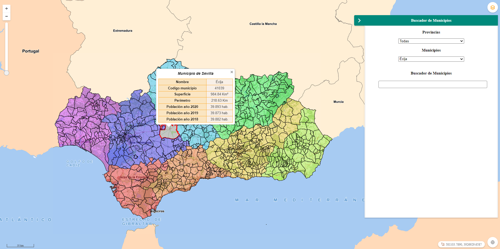
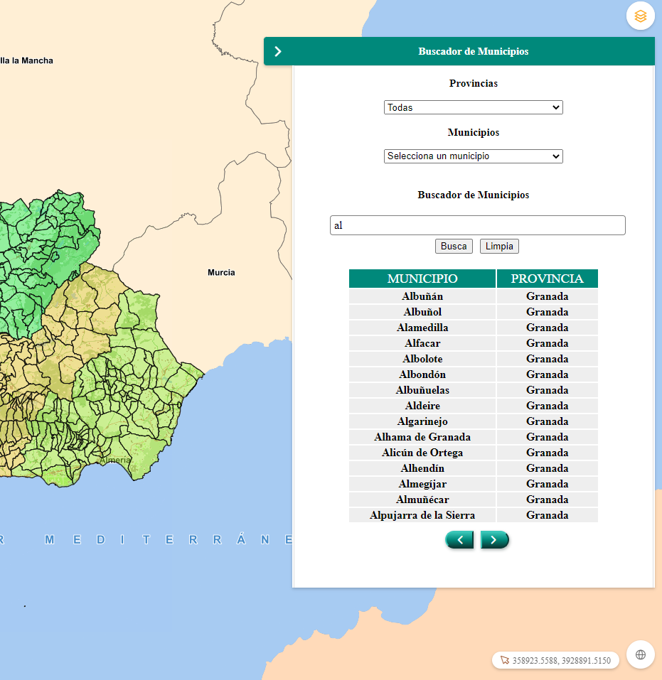
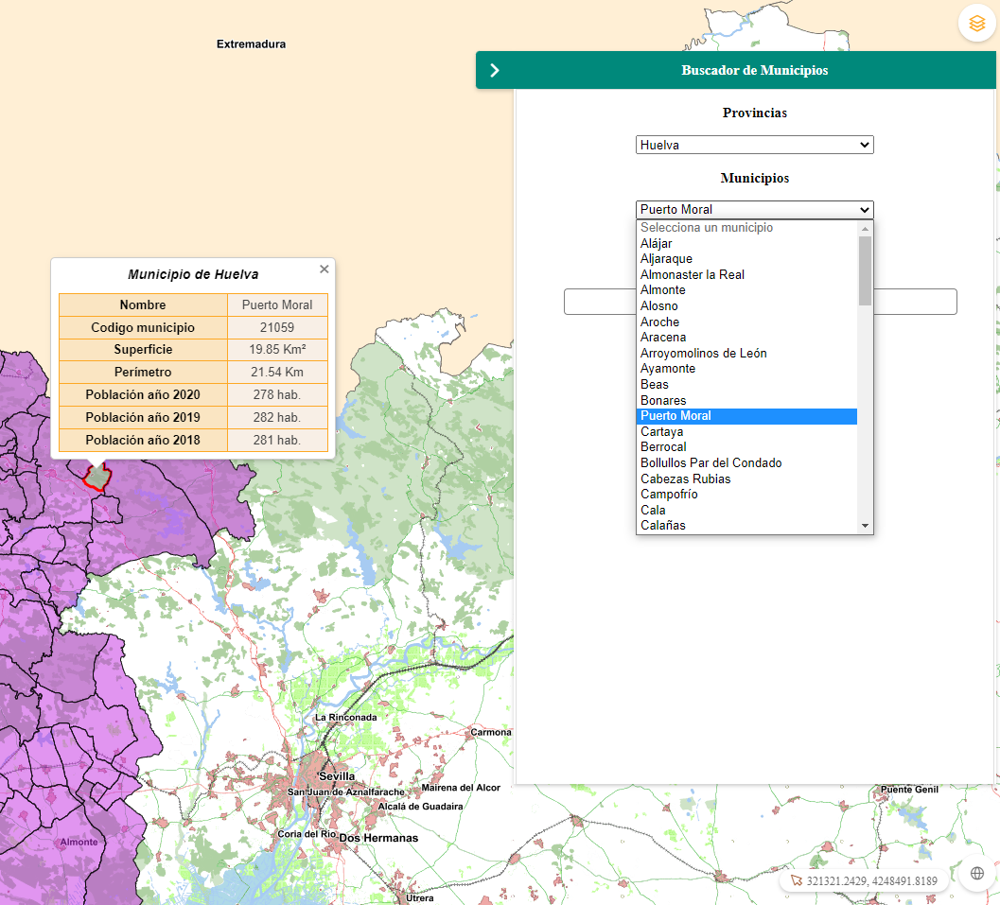

# M.plugin.Munpanel

## Descripción

 Plugin de [Mapea](https://github.com/sigcorporativo-ja/Mapea4) para seleccionar y localizar municipios de Andalucía.

 El Plugin presenta un panel en el que se pueden seleccionar los municipios de toda la Comunidad Autónoma o bien seleccionarlos por provincias.  Dicho panel cuenta con una caja de texto en la que se pueden realizar búsquedas de municipios dentro de toda la Comunidad Autónoma (en el caso de seleccionar Provincias > Todas) o dentro de una determianda Provincia (en el caso de seleccionar la Provincia en cuestión).



 Dicha búsqueda se presenta en una tabla en la que se puede seleccionar el municipio y mostrarse en el mapa haciendo click sobre las celdas de la tabla. De igual modo se puede seleccionar un municipio haciendo click sobre el mismo dentro del mapa.

 

 Al seleccionar el municipio se presenta en pantalla el polígono del municipio resaltado y un popup con su Nombre, su Código de municipio, su Superficie, su Perímetro y los datos de Población correspondientes al Padrón de los años 2020, 2019 y 2018.



 Tanto el cálculo de la superficie del municipio como el del perímetro se realizan a partir de las coordenadas del municipio seleccionado.


 ## Definición Layers de Mapea ##
 
 La geometria de los municipios se obtiene de la capa DERA_g13_limites_administrativos, cuya configuración queda definida en test.js

 ```javascript

 const Almeria = new M.layer.GeoJSON(
  {
    name: "Almeria",
    url: "http://www.ideandalucia.es/services/DERA_g13_limites_administrativos/wfs?service=WFS&version=1.0.0&request=GetFeature&typename=DERA_g13_limites_administrativos%3Ag13_01_TerminoMunicipal&outputFormat=json&srsname=EPSG%3A25830&CQL_FILTER=provincia%3D'Almer%C3%ADa'&propertyName=nombre,cod_mun,provincia,geom",
    extract: false
  }
);
const Cadiz = new M.layer.GeoJSON(
  {
    name: "Cadiz",
    url: "http://www.ideandalucia.es/services/DERA_g13_limites_administrativos/wfs?service=WFS&version=1.0.0&request=GetFeature&typename=DERA_g13_limites_administrativos%3Ag13_01_TerminoMunicipal&outputFormat=json&srsname=EPSG%3A25830&CQL_FILTER=provincia%3D'C%C3%A1diz'&propertyName=nombre,cod_mun,provincia,geom",
    extract: false
  }
);

const Cordoba = new M.layer.GeoJSON(
  {
    name: "Cordoba",
    url: "http://www.ideandalucia.es/services/DERA_g13_limites_administrativos/wfs?service=WFS&version=1.0.0&request=GetFeature&typename=DERA_g13_limites_administrativos%3Ag13_01_TerminoMunicipal&outputFormat=json&srsname=EPSG%3A25830&CQL_FILTER=provincia%3D'C%C3%B3rdoba'&propertyName=nombre,cod_mun,provincia,geom",
    extract: false
  }
);

const Granada = new M.layer.GeoJSON(
  {
    name: "Granada",
    url: "http://www.ideandalucia.es/services/DERA_g13_limites_administrativos/wfs?service=WFS&version=1.0.0&request=GetFeature&typename=DERA_g13_limites_administrativos%3Ag13_01_TerminoMunicipal&outputFormat=json&srsname=EPSG%3A25830&CQL_FILTER=provincia%3D'Granada'&propertyName=nombre,cod_mun,provincia,geom",
    extract: false
  }
);

const Huelva = new M.layer.GeoJSON(
  {
    name: "Huelva",
    url: "http://www.ideandalucia.es/services/DERA_g13_limites_administrativos/wfs?service=WFS&version=1.0.0&request=GetFeature&typename=DERA_g13_limites_administrativos%3Ag13_01_TerminoMunicipal&outputFormat=json&srsname=EPSG%3A25830&CQL_FILTER=provincia%3D'Huelva'&propertyName=nombre,cod_mun,provincia,geom",
    extract: false
  }
);

const Jaen = new M.layer.GeoJSON(
  {
    name: "Jaen",
    url: "http://www.ideandalucia.es/services/DERA_g13_limites_administrativos/wfs?service=WFS&version=1.0.0&request=GetFeature&typename=DERA_g13_limites_administrativos%3Ag13_01_TerminoMunicipal&outputFormat=json&srsname=EPSG%3A25830&CQL_FILTER=provincia%3D'Ja%C3%A9n'&propertyName=nombre,cod_mun,provincia,geom",
    extract: false
  }
);

const Malaga = new M.layer.GeoJSON(
  {
    name: "Malaga",
    url: "http://www.ideandalucia.es/services/DERA_g13_limites_administrativos/wfs?service=WFS&version=1.0.0&request=GetFeature&typename=DERA_g13_limites_administrativos%3Ag13_01_TerminoMunicipal&outputFormat=json&srsname=EPSG%3A25830&CQL_FILTER=provincia%3D'M%C3%A1laga'&propertyName=nombre,cod_mun,provincia,geom",
    extract: false
  }
);

const Sevilla = new M.layer.GeoJSON(
  {
    name: "Sevilla",
    url: "http://www.ideandalucia.es/services/DERA_g13_limites_administrativos/wfs?service=WFS&version=1.0.0&request=GetFeature&typename=DERA_g13_limites_administrativos%3Ag13_01_TerminoMunicipal&outputFormat=json&srsname=EPSG%3A25830&CQL_FILTER=provincia%3D'Sevilla'&propertyName=nombre,cod_mun,provincia,geom",
    extract: false
  }
);


const estiloCadiz = new M.style.Polygon({
  fill: {
    color: '#e22c2c',
    opacity: 0.5,
  },
  stroke: {
    color: '#0c0c0c',
    width: 1
  }
});

const estiloMalaga = new M.style.Polygon({
  fill: {
    color: '#e26f2c',
    opacity: 0.5,
  },
  stroke: {
    color: '#0c0c0c',
    width: 1
  }
});

const estiloGranada = new M.style.Polygon({
  fill: {
    color: '#e2c12c',
    opacity: 0.5,
  },
  stroke: {
    color: '#0c0c0c',
    width: 1
  }
});

const estiloAlmeria = new M.style.Polygon({
  fill: {
    color: '#9ce22c',
    opacity: 0.5,
  },
  stroke: {
    color: '#0c0c0c',
    width: 1
  }
});

const estiloJaen = new M.style.Polygon({
  fill: {
    color: '#2ce244',
    opacity: 0.5,
  },
  stroke: {
    color: '#0c0c0c',
    width: 1
  }
});

const estiloCordoba = new M.style.Polygon({
  fill: {
    color: '#2cb7e2',
    opacity: 0.5,
  },
  stroke: {
    color: '#0c0c0c',
    width: 1
  }
});

const estiloSevilla = new M.style.Polygon({
  fill: {
    color: '#382ce2',
    opacity: 0.5,
  },
  stroke: {
    color: '#0c0c0c',
    width: 1
  }
});

const estiloHuelva = new M.style.Polygon({
  fill: {
    color: '#c42ce2',
    opacity: 0.5,
  },
  stroke: {
    color: '#0c0c0c',
    width: 1
  }
});


const categoriaCadiz = new M.style.Category("provincia", {
  "Cádiz": estiloCadiz
});

const categoriaMalaga = new M.style.Category("provincia", {
  "Málaga": estiloMalaga
});

const categoriaGranada = new M.style.Category("provincia", {
  "Granada": estiloGranada
});

const categoriaAlmeria = new M.style.Category("provincia", {
  "Almería": estiloAlmeria
});

const categoriaJaen = new M.style.Category("provincia", {
  "Jaén": estiloJaen
});

const categoriaCordoba = new M.style.Category("provincia", {
  "Córdoba": estiloCordoba
});

const categoriaSevilla = new M.style.Category("provincia", {
  "Sevilla": estiloSevilla
});

const categoriaHuelva = new M.style.Category("provincia", {
  "Huelva": estiloHuelva
});

```
## Recursos
- js: munpanel.ol.min.js
- css: munpanel.ol.min.css

