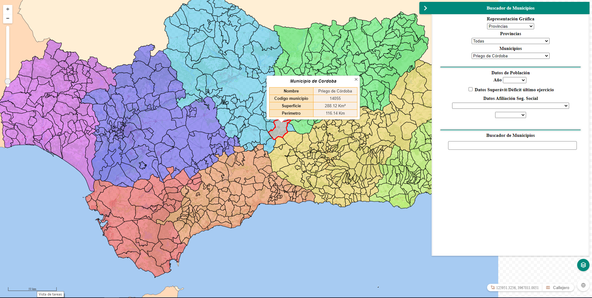
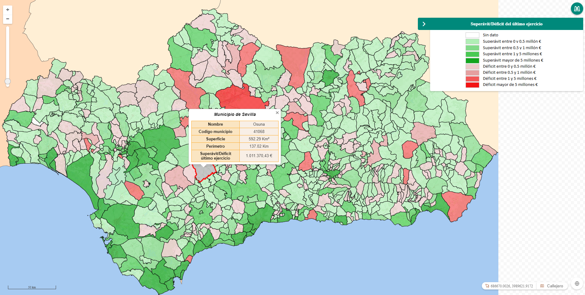

# M.plugin.Munpanel

## Descripción

 Plugin de [Mapea](https://github.com/sigcorporativo-ja/Mapea4) para seleccionar y localizar municipios de Andalucía, así como para mostrar y representar datos de Población, Déficit/Superávit del último ejercicio y Afiliación a la Seguridad Social.

El Plugin presenta un panel en el que se pueden representar los datos de Población desde el año 1996 hasta el actual, de Déficit/Superávit del último ejercicio y de Afiliación a la Seguridad Social del último año registrado clasificado por Régimen y por Sexos.  Dichos datos se obtienen del Banco de Datos Estadísticos de Andalucía (BADEA).
 
En dicho panel se pueden seleccionar los municipios de toda la Comunidad Autónoma o bien seleccionarlos por provincias.  El panel cuenta con una caja de texto en la que se pueden realizar búsquedas de municipios dentro de toda la Comunidad Autónoma (en el caso de seleccionar Provincias > Todas) o dentro de una determianda Provincia (en el caso de seleccionar la Provincia en cuestión).




 Dicha búsqueda se presenta en una tabla en la que se puede seleccionar el municipio y mostrarse en el mapa haciendo click sobre las celdas de la tabla. De igual modo se puede seleccionar un municipio haciendo click sobre el mismo dentro del mapa.

 

 Al seleccionar el municipio se presenta en pantalla el polígono del municipio resaltado y un popup con su Nombre, su Código de municipio, su Superficie y su Perímetro. En el caso haber seleccionado datos de Población, Superávit/Déficit o Afiliación a la Seguridad Social también se mostrarán.


 Tanto el cálculo de la superficie del municipio como el del perímetro se realizan a partir de las coordenadas del municipio seleccionado.

 Al generar los mapas con los datos de Población, Déficit/Superávit y afiliación a la Seguridad Social se genera una Leyenda automáticamente que es consultable en el panel inferior.

 
 *Ejemplo de leyenda de datos de Población*


 *Ejemplo de leyenda de datos de Superávit/Déficit del último ejercicio*

 
 *Ejemplo de leyenda de datos de Afiliación a la Seguridad Social*

 Del mismo modo se genera una Leyenda con la simbología asociada a cada Provincia.


 *Ejemplo de leyenda de Municipios por Provincias*

 ## Definición Layers de Mapea ##
 
 La geometria de los municipios se obtiene de la capa DERA_g13_limites_administrativos, cuya configuración y estilos asociados quedan definidos en test.js

 ```javascript

 const Almeria = new M.layer.GeoJSON(
  {
    name: "Almeria",
    url: "http://www.ideandalucia.es/services/DERA_g13_limites_administrativos/wfs?service=WFS&version=1.0.0&request=GetFeature&typename=DERA_g13_limites_administrativos%3Ag13_01_TerminoMunicipal&outputFormat=json&srsname=EPSG%3A25830&CQL_FILTER=provincia%3D'Almer%C3%ADa'&propertyName=nombre,cod_mun,provincia,geom",
    extract: false
  }
);
const Cadiz = new M.layer.GeoJSON(
  {
    name: "Cadiz",
    url: "http://www.ideandalucia.es/services/DERA_g13_limites_administrativos/wfs?service=WFS&version=1.0.0&request=GetFeature&typename=DERA_g13_limites_administrativos%3Ag13_01_TerminoMunicipal&outputFormat=json&srsname=EPSG%3A25830&CQL_FILTER=provincia%3D'C%C3%A1diz'&propertyName=nombre,cod_mun,provincia,geom",
    extract: false
  }
);

const Cordoba = new M.layer.GeoJSON(
  {
    name: "Cordoba",
    url: "http://www.ideandalucia.es/services/DERA_g13_limites_administrativos/wfs?service=WFS&version=1.0.0&request=GetFeature&typename=DERA_g13_limites_administrativos%3Ag13_01_TerminoMunicipal&outputFormat=json&srsname=EPSG%3A25830&CQL_FILTER=provincia%3D'C%C3%B3rdoba'&propertyName=nombre,cod_mun,provincia,geom",
    extract: false
  }
);

const Granada = new M.layer.GeoJSON(
  {
    name: "Granada",
    url: "http://www.ideandalucia.es/services/DERA_g13_limites_administrativos/wfs?service=WFS&version=1.0.0&request=GetFeature&typename=DERA_g13_limites_administrativos%3Ag13_01_TerminoMunicipal&outputFormat=json&srsname=EPSG%3A25830&CQL_FILTER=provincia%3D'Granada'&propertyName=nombre,cod_mun,provincia,geom",
    extract: false
  }
);

const Huelva = new M.layer.GeoJSON(
  {
    name: "Huelva",
    url: "http://www.ideandalucia.es/services/DERA_g13_limites_administrativos/wfs?service=WFS&version=1.0.0&request=GetFeature&typename=DERA_g13_limites_administrativos%3Ag13_01_TerminoMunicipal&outputFormat=json&srsname=EPSG%3A25830&CQL_FILTER=provincia%3D'Huelva'&propertyName=nombre,cod_mun,provincia,geom",
    extract: false
  }
);

const Jaen = new M.layer.GeoJSON(
  {
    name: "Jaen",
    url: "http://www.ideandalucia.es/services/DERA_g13_limites_administrativos/wfs?service=WFS&version=1.0.0&request=GetFeature&typename=DERA_g13_limites_administrativos%3Ag13_01_TerminoMunicipal&outputFormat=json&srsname=EPSG%3A25830&CQL_FILTER=provincia%3D'Ja%C3%A9n'&propertyName=nombre,cod_mun,provincia,geom",
    extract: false
  }
);

const Malaga = new M.layer.GeoJSON(
  {
    name: "Malaga",
    url: "http://www.ideandalucia.es/services/DERA_g13_limites_administrativos/wfs?service=WFS&version=1.0.0&request=GetFeature&typename=DERA_g13_limites_administrativos%3Ag13_01_TerminoMunicipal&outputFormat=json&srsname=EPSG%3A25830&CQL_FILTER=provincia%3D'M%C3%A1laga'&propertyName=nombre,cod_mun,provincia,geom",
    extract: false
  }
);

const Sevilla = new M.layer.GeoJSON(
  {
    name: "Sevilla",
    url: "http://www.ideandalucia.es/services/DERA_g13_limites_administrativos/wfs?service=WFS&version=1.0.0&request=GetFeature&typename=DERA_g13_limites_administrativos%3Ag13_01_TerminoMunicipal&outputFormat=json&srsname=EPSG%3A25830&CQL_FILTER=provincia%3D'Sevilla'&propertyName=nombre,cod_mun,provincia,geom",
    extract: false
  }
);


const estiloCadiz = new M.style.Polygon({
  fill: {
    color: '#e22c2c',
    opacity: 0.5,
  },
  stroke: {
    color: '#0c0c0c',
    width: 1
  }
});

const estiloMalaga = new M.style.Polygon({
  fill: {
    color: '#e26f2c',
    opacity: 0.5,
  },
  stroke: {
    color: '#0c0c0c',
    width: 1
  }
});

const estiloGranada = new M.style.Polygon({
  fill: {
    color: '#e2c12c',
    opacity: 0.5,
  },
  stroke: {
    color: '#0c0c0c',
    width: 1
  }
});

const estiloAlmeria = new M.style.Polygon({
  fill: {
    color: '#9ce22c',
    opacity: 0.5,
  },
  stroke: {
    color: '#0c0c0c',
    width: 1
  }
});

const estiloJaen = new M.style.Polygon({
  fill: {
    color: '#2ce244',
    opacity: 0.5,
  },
  stroke: {
    color: '#0c0c0c',
    width: 1
  }
});

const estiloCordoba = new M.style.Polygon({
  fill: {
    color: '#2cb7e2',
    opacity: 0.5,
  },
  stroke: {
    color: '#0c0c0c',
    width: 1
  }
});

const estiloSevilla = new M.style.Polygon({
  fill: {
    color: '#382ce2',
    opacity: 0.5,
  },
  stroke: {
    color: '#0c0c0c',
    width: 1
  }
});

const estiloHuelva = new M.style.Polygon({
  fill: {
    color: '#c42ce2',
    opacity: 0.5,
  },
  stroke: {
    color: '#0c0c0c',
    width: 1
  }
});


// ESTILOS REPRESENTACION POBLACIÓN

const pob_1000 = new M.style.Polygon({
  fill: {
    color: '#d8d8d8',
    opacity: 0.7,
  },
  stroke: {
    color: '#0c0c0c',
    width: 1
  }
});

const pob_1000_5000 = new M.style.Polygon({
  fill: {
    color: '#e0adad',
    opacity: 0.7,
  },
  stroke: {
    color: '#0c0c0c',
    width: 1
  }
});

const pob_5000_10000 = new M.style.Polygon({
  fill: {
    color: '#e88282',
    opacity: 0.7,
  },
  stroke: {
    color: '#0c0c0c',
    width: 1
  }
});

const pob_10000_50000 = new M.style.Polygon({
  fill: {
    color: '#f05656',
    opacity: 0.7,
  },
  stroke: {
    color: '#0c0c0c',
    width: 1
  }
});

const pob_50000_100000 = new M.style.Polygon({
  fill: {
    color: '#f82b2b',
    opacity: 0.7,
  },
  stroke: {
    color: '#0c0c0c',
    width: 1
  }
});

const pob100000_ = new M.style.Polygon({
  fill: {
    color: '#ff0000',
    opacity: 0.7,
  },
  stroke: {
    color: '#0c0c0c',
    width: 1
  }
});

// ESTILOS DE SUPERAVIT

const sup_sin_dato = new M.style.Polygon({
  fill: {
    color: '#ffffff',
    opacity: 0.7,
  },
  stroke: {
    color: '#0c0c0c',
    width: 1
  }
});

const sup0_05 = new M.style.Polygon({
  fill: {
    color: '#b0eeb5',
    opacity: 0.7,
  },
  stroke: {
    color: '#0c0c0c',
    width: 1
  }
});

const sup05_1 = new M.style.Polygon({
  fill: {
    color: '#81da88',
    opacity: 0.7,
  },
  stroke: {
    color: '#0c0c0c',
    width: 1
  }
});

const sup1_5 = new M.style.Polygon({
  fill: {
    color: '#4aca54',
    opacity: 0.7,
  },
  stroke: {
    color: '#0c0c0c',
    width: 1
  }
});

const sup5_ = new M.style.Polygon({
  fill: {
    color: '#11a51e',
    opacity: 0.7,
  },
  stroke: {
    color: '#0c0c0c',
    width: 1
  }
});

const def0_05 = new M.style.Polygon({
  fill: {
    color: '#eccbcb',
    opacity: 0.7,
  },
  stroke: {
    color: '#0c0c0c',
    width: 1
  }
});

const def05_1 = new M.style.Polygon({
  fill: {
    color: '#e5a0a0',
    opacity: 0.7,
  },
  stroke: {
    color: '#0c0c0c',
    width: 1
  }
});

const def1_5 = new M.style.Polygon({
  fill: {
    color: '#f35757',
    opacity: 0.7,
  },
  stroke: {
    color: '#0c0c0c',
    width: 1
  }
});

const def5_ = new M.style.Polygon({
  fill: {
    color: '#f31313',
    opacity: 0.7,
  },
  stroke: {
    color: '#0c0c0c',
    width: 1
  }
});

// ESTILOS DE AFILIACION

const afi_sin_dato = new M.style.Polygon({ 
  fill: {
    color: '#ffffff',
    opacity: 0.7,
  },
  stroke: {
    color: '#0c0c0c',
    width: 1
  }
});

const afi0_100 = new M.style.Polygon({
  fill: {
    color: '#d0d0e6',
    opacity: 0.7,
  },
  stroke: {
    color: '#0c0c0c',
    width: 1
  }
});

const afi100_1000 = new M.style.Polygon({
  fill: {
    color: '#ababe7',
    opacity: 0.7,
  },
  stroke: {
    color: '#0c0c0c',
    width: 1
  }
});

const afi1000_5000 = new M.style.Polygon({
  fill: {
    color: '#7e7eda',
    opacity: 0.7,
  },
  stroke: {
    color: '#0c0c0c',
    width: 1
  }
});

const afi5000_10000 = new M.style.Polygon({
  fill: {
    color: '#5050d6',
    opacity: 0.7,
  },
  stroke: {
    color: '#0c0c0c',
    width: 1
  }
});

const afi10000_ = new M.style.Polygon({
  fill: {
    color: '#1919e2',
    opacity: 0.7,
  },
  stroke: {
    color: '#0c0c0c',
    width: 1
  }
});


const categoriaCadiz = new M.style.Category("provincia", {
  "Cádiz": estiloCadiz
});

const categoriaMalaga = new M.style.Category("provincia", {
  "Málaga": estiloMalaga
});

const categoriaGranada = new M.style.Category("provincia", {
  "Granada": estiloGranada
});

const categoriaAlmeria = new M.style.Category("provincia", {
  "Almería": estiloAlmeria
});

const categoriaJaen = new M.style.Category("provincia", {
  "Jaén": estiloJaen
});

const categoriaCordoba = new M.style.Category("provincia", {
  "Córdoba": estiloCordoba
});

const categoriaSevilla = new M.style.Category("provincia", {
  "Sevilla": estiloSevilla
});

const categoriaHuelva = new M.style.Category("provincia", {
  "Huelva": estiloHuelva
});

```

Las variables de configuración del Plugin quedan definidas también en test.js de la siguiente manera

```javascript
const munSelect = '';
const provinciaSeleccionada = 'Select';
const numeroTablas = 0;
const pag = 0;
const reg = 0;
const num_results = 9; // número de resultados por página en la búsqueda
const result = [];
const PoblacionJson = '';
const SuperavitJson = '';
const SegsocialJson = '';
const listPoblacion = [];
const listSuperavit = [];
const listSegsocial = [];
const superavit = '---';
const ssHombres = '---';
const ssMujeres = '---';
const ssAmbos = '---';
const pobSelect = '---';
const pobYear = '';
const ssYear = '';
const ssRegimen = '';
const ssSexo = '';
const stPoblacion = false;
const stSuperavit = false;
const stSegsocial = false;
const opcPoblacion = false;
const opcSuperavit = false;
const opcSegsocial = false;
const stAnterior = false;
const munAnterior = false;
const selectedFeature = '';
const selectedProv = '';

const configMunpanel = {
  layerList: [
    Almeria,
    Granada,
    Jaen,
    Cordoba,
    Sevilla,
    Huelva,
    Cadiz,
    Malaga
  ],
  styleList: [
    categoriaAlmeria,
    categoriaGranada,
    categoriaJaen,
    categoriaCordoba,
    categoriaSevilla,
    categoriaHuelva,
    categoriaCadiz,
    categoriaMalaga,
  ],
  pobList: {
    pob_1000: pob_1000,
    pob_1000_5000: pob_1000_5000,
    pob_5000_10000: pob_5000_10000,
    pob_10000_50000: pob_10000_50000,
    pob_50000_100000: pob_50000_100000,
    pob100000_: pob100000_
  },
  supList: {
    sup_sin_dato: sup_sin_dato,
    sup0_05: sup0_05,
    sup05_1: sup05_1,
    sup1_5: sup1_5,
    sup5_: sup5_,
    def0_05: def0_05,
    def05_1: def05_1,
    def1_5: def1_5,
    def5_: def5_
  },
  afiList: {
    afi_sin_dato: afi_sin_dato,
    afi0_100: afi0_100,
    afi100_1000: afi100_1000,
    afi1000_5000: afi1000_5000,
    afi5000_10000: afi5000_10000,
    afi10000_:afi10000_
  },
  selectedFeature: selectedFeature,
  selectedProv: selectedProv,
  listPoblacion: listPoblacion,
  pobYear: pobYear,
  pobSelect: pobSelect,
  listSuperavit: listSuperavit,
  superavit: superavit,
  listSegsocial: listSegsocial,
  ssRegimen: ssRegimen,
  ssSexo: ssSexo,
  ssYear: ssYear,
  ssHombres: ssHombres,
  ssMujeres: ssMujeres,
  ssAmbos: ssAmbos,
  provinciaSeleccionada: provinciaSeleccionada,
  munSelect: munSelect,
  numeroTablas: numeroTablas,
  pag: pag,
  reg: reg,
  result: result,
  num_results: num_results,
  stAnterior: stAnterior,
  munAnterior: munAnterior,
  status: {
    PoblacionJson: PoblacionJson,
    SegsocialJson: SegsocialJson,
    SuperavitJson: SuperavitJson,
    stSegsocial: stSegsocial,
    stSuperavit: stSuperavit,
    stPoblacion: stPoblacion,
    opcPoblacion: opcPoblacion,
    opcSuperavit: opcSuperavit,
    opcSegsocial: opcSegsocial
  }
}
```

## Recursos
- js: munpanel.ol.min.js
- css: munpanel.ol.min.css

